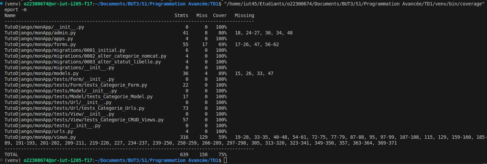
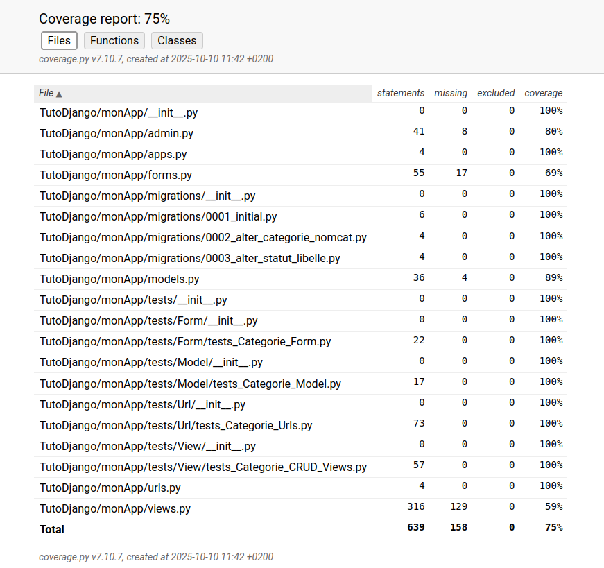
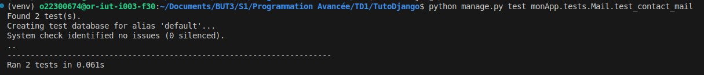

___

## 🚀 Lancer le projet

Cloner le dépôt, se placer à la racine du projet puis exécuter la commande suivante :

```bash
./lancement.sh
```
___

# TD1 - Première application Django

Projet réalisé dans le cadre du TD1 de Programmation Avancée.  
Application Django simple avec une application `monApp` contenant les pages :  
- **Home** : page d'accueil (avec et sans paramètre)  
- **Contact** : page de contact  
- **About** : page à propos

J'ai donc appris à configurer la base de la structure de Django pour mes futurs projets.

___

# TP1 - Première application Django

Dans ce TP, j’ai réalisé les exercices suivants :

Création de modèles : Produit, Categorie, Statut.

Ajout de données dans la base via le shell Django.

Récupération des objets avec Produit.objects.all() et affichage dans une page HTML.

Affichage des catégories et statuts associés à chaque produit.

Création de vues et liaison avec le fichier urls.py pour naviguer entre les pages.

Ce TP m’a permis de comprendre le fonctionnement de Django, la gestion des modèles, des vues et des URL, ainsi que l’affichage dynamique des données.
___

# TD2 - Administration et redirection

Pour ce TD, j’ai travaillé sur l’administration et la navigation :

- **Interface admin Django** pour gérer `Produit`, `Categorie`, `Statut` et `Rayon`.  
- **Personnalisation** : colonnes visibles (`list_display`), modification directe (`list_editable`), boutons radio. (`radio_fields`), recherche (`search_fields`), filtres (`list_filter`), hiérarchie par date (`date_hierarchy`), tri (`ordering`).
- **Relations** : ajout de produits directement dans la fiche `Categorie` via `ProduitInline`.  
- **Actions personnalisées** : mettre les produits en ligne ou hors ligne.  
- **Optimisation** : installation de Django Debug Toolbar pour vérifier le nombre de requêtes SQL.  
- **Redirections et navigation** : redirection après certaines actions et vérification de la navigation entre les pages.  

___

# TP2 - Templates et refactor

Dans ce TP, j’ai travaillé sur l’amélioration du rendu et la structure des templates :  

- **Refactor des vues** pour utiliser `render` et les templates au lieu de `HttpResponse` brut.  
- **Création de `base.html`** comme template principal avec barre de navigation et footer.  
- **Utilisation de blocs** (``) pour insérer le contenu spécifique aux pages.  
- **Templates spécifiques** pour chaque page : `list_produits.html`, `detail_produit.html`, `ajouter_produit.html`.  
- **Liens dynamiques** avec `` pour naviguer entre les pages.  
- **Chargement des fichiers statiques** avec `` pour CSS et Bootstrap.
- **Navigation complète** : home, produits, catégories, statuts, about, contact.


Séance suivante : 

- **Refactor des vues** pour utiliser `render` et les templates au lieu de `HttpResponse` brut.  
- **Création de `base.html`** comme template principal avec barre de navigation et footer.  
- **Utilisation de blocs** (``) pour insérer le contenu spécifique aux pages.  
- **Templates spécifiques** pour chaque page : `list_produits.html`, `detail_produit.html`, `ajouter_produit.html`.  
- **Liens dynamiques** avec `` pour naviguer entre les pages.  
- **Chargement des fichiers statiques** avec `` pour CSS et Bootstrap.  
- **Navigation complète** : home, produits, catégories, statuts, about, contact.  
- **Changement de la relation Many-to-Many** avec le modèle `Contenir` pour une meilleure gestion des relations.  
- **Ajout de Bootstrap** pour améliorer le style et la présentation des pages. 
- **Ajout du bouton Admin** dans la barre de navigation.  
- **Style amélioré** des pages : boutons, mise en page, typographie, et mise en valeur du contenu.  

___

# TD3 - Détails des produits et début de l’authentification

Pour ce TD, j’ai ajouté :

- **Page détails du produit** : `detail_produit.html` pour afficher toutes les informations d’un produit (`référence`, `intitulé`, `prix`, `catégorie`, `statut`, `rayons`, `date de fabrication`).  
- **Navigation vers la page détail** depuis la liste des produits avec un bouton "Voir". 
- **Refactor des templates existants** pour améliorer l’affichage et la lisibilité.
- **Début du système d’authentification** : création des vues `ConnectView`, `RegisterView` et `DisconnectView` pour gérer la connexion, l’inscription et la déconnexion.
- **Templates pour login, register et logout** : `page_login.html`, `page_register.html`, `page_logout.html`.
- **Barre de navigation conditionnelle** selon l’état de connexion de l’utilisateur (`user.is_authenticated`) (pas encore fonctionnel).


Pour ce TD (23/09), j’ai ajouté :

- **Page détails de la catégorie** : `detail_categorie.html` pour afficher les informations d’une catégorie et ses produits associés.
- **Navigation vers la page détail catégorie** depuis la liste des catégories  
- **Page détails du statut** : `detail_statut.html` pour afficher les informations d’un statut et les produits associés  
- **Navigation vers la page détail statut** depuis la liste des statuts avec un bouton "Voir"  .
- **Barre de navigation avec login/logout** selon l’état de connexion de l’utilisateur (`user.is_authenticated`) avec un bouton de déconnexion fonctionnel.
- **Système d’authentification fonctionnel** : Correction des classes :`ConnectView`, `RegisterView` et `DisconnectView`.

Pour ce TD (25/09), j’ai ajouté :

- **Gestion du bug Inscription (Même compte)** : Modification de la classe `RegisterView` pour gérer l'erreur si le compte existe déjà.
- **Ajout d'un formulaire de contact** : Modification de `page_home.html`, ajout d'une nouvelle classe dans views.py : `ContactView` avec son url.
- **Ajout d'une redirection vers une page de confirmation** : Une fois le formulaire envoyé, l'utilisateur est redirigé vers une page de confirmation `email_sent.html`.

___

# TP3 - Gestion CRUD des Produits et ModelForms avec Django

- **Ajout d'un formulaire de création de produits** : Ajout d'un produit via un formulaire intégré avec `create_produit.html` et `ProduitCreate.html`

  Pour ce TD (30/09), j’ai ajouté :

- **Tout ce qui concerne rayons** : Ajout dans la navbar le rayon.
- **CRUD Produit** : Notamment avec `detail_produit.html`, `update_produit.html` et `delete_produit.html`.
- **CRUD Catégorie** : Notamment avec `detail_categorie.html`, `update_categorie.html`, `delete_categorie.html`.
- **Modification form** : J'ai modifié les instructions dans forms pour les lier à la BD.

  Pour ce TP (02/10), j’ai ajouté :
  - **Mis de coté Rayon et Statuts** : Fontionnalités déja implémentées pour Prdouit et Catégorie.
  - **Résolution bugs admin** : Bug admin et BD lié aux produits.

___

# TD N°4 – Dessert

  - **Amélioration ergonomiques** : Avec les `ProduitListView`,`CategorieListView` et `StatutListView`.
  - **Ajout CRUD pour toutes les entités** : Ajout des html, des methodes dans `views.py` et des routes dans `utls.py`.
  - **Sécurisation login** : Si je ne suis pas connecté, impossible de modifier ou ajouter donc redirection vers login.
  - **Attribution rayons à produit** : Modification BD pour que le rayon puisse calculer le nombre de produits, prix...
  - **Barre de recherche** : Ajout d'une barre de recherche pour les produits (fonctionnelle).
  - **Sessions & Permissions** : Ajout des sessiosn et permissions pour simplifier la navigation en fonction du statut.

  Pour ce TP (09/10), j’ai ajouté :

  - **Sécurisation login** : Ajout de restrictions à l'inscription.
  - **Gestion doublons** : Impossible de créer deux fois la même entité (nom).
  - **Résolution des bugs de navigation** : Surtout entre `contact`, `about` et l'affichage des produits.
  - **CSS** : Modification du style général des pages pour mettre en forme les fonctionnalités.
  - **MCD** : Ajout du MCD correspondant à mon application
  
___

# TP N°4 – Dessert

  - **Test Modèle** : Ajout des tests pour le modèle avec la classe `CategorieModelTest`.
  - **Test Formulaires** : Ajout des tests pour les formulaires avec la classe `CategorieFormTest`.
  - **Test URL** : Ajout des tests pour les URLs avec la classe `CategorieUrlsTest`.


Temps personnel (10/10), j’ai ajouté :

- **Test Views** : Ajout des tests pour les views avec les classes `CategorieCreateViewTest`, `CategorieDetailViewTest`, `CategorieUpdateViewTest` et `CategorieDeleteViewTest`.
- **Installation et execution du coverage** : Execution des tests + coverage :



- **Installation et execution du coverage html** : Execution des tests + coverage en version html (files, functions et classes):



___

# TD N°5 – Digestif

Pour ce TD (14/10), j’ai ajouté :

- **API REST** : Mise en place d’une API avec Django Rest Framework, utilisant `ModelViewSet`, `ReadOnlyModelViewSet` (pour Statut), et `DefaultRouter` pour les URLs.

- **Filtrage** : Filtres dans `ProduitViewSet` (par categorie et datefilter) et dans `CategorieSerializer` (≥ 2 produits après 13/08/2025).

- **Optimisation** : `prefetch_related` pour réduire les requêtes SQL, serializers imbriqués pour inclure les produits.

- **Pagination** : Pagination globale (LimitOffsetPagination, PAGE_SIZE=1) et personnalisée pour `CategorieViewSet` (2-4 éléments).

- **Actions du client** : CRUD avec serializers différents pour list et retrieve via get_serializer_class.

- **Mixin et validations** : `MultipleSerializerMixin` pour gérer les serializers, validations dans `CategorieSerializerList` (doublons, max 100 caractères).

Je ne fais pas volontairement la partie Authentification pour améliorer mon code et ajouter de nouvelles fonctionnalités

Pour ce TP (16/10), j’ai ajouté :

- **Documentation Swagger** : La documentation Swagger de Django Rest avec openAPI est disponible allant sur cette url : http://127.0.0.1:8000/monApp/api/swagger/

- **Test Email** : Ajout du test d'envoi d'email dans tests/Mail avec la classe `ContactMailTest`:



Commencement d'une nouvelle fonctionnalité : Ajout d'un dashbord du magasin dans la page d'accueil. (à finir sur le temps personnel)